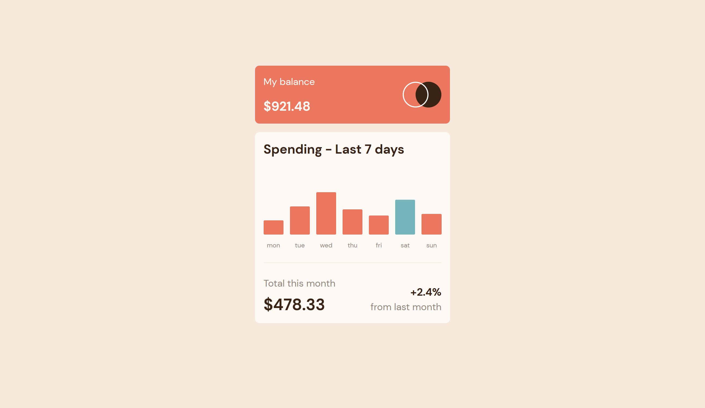
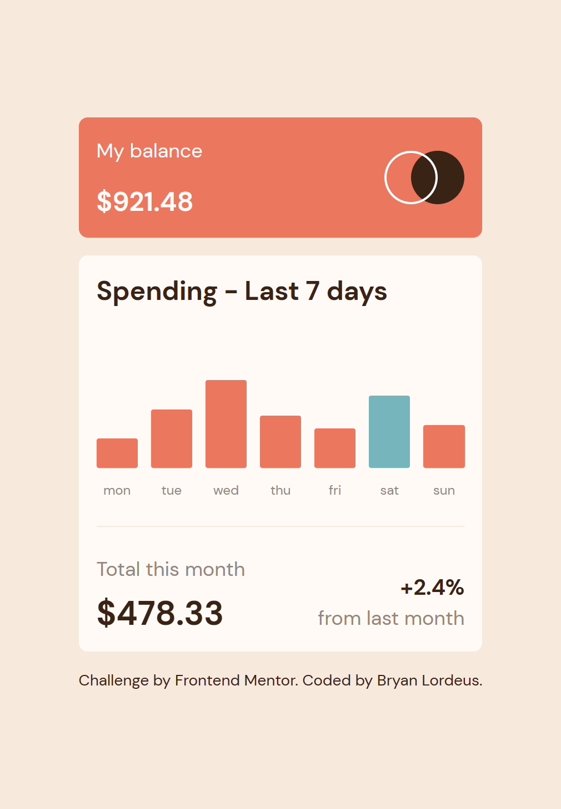

# Frontend Mentor - Expenses chart component solution

This is a solution to the [Expenses chart component challenge on Frontend Mentor](https://www.frontendmentor.io/challenges/expenses-chart-component-e7yJBUdjwt). Frontend Mentor challenges help you improve your coding skills by building realistic projects.

## Table of contents

* [Overview](#overview)
    * [The challenge](#the-challenge)
    * [Screenshot](#screenshot)
    * [Links](#links)
* [My process](#my-process)
    * [Built with](#built-with)
    * [What I learned](#what-i-learned)
    * [Continued development](#continued-development)
    * [Useful resources](#useful-resources)
* [Author](#author)

## Overview

### The challenge

Users should be able to:

* View the bar chart and hover over the individual bars to see the correct amounts for each day
* See the current day’s bar highlighted in a different colour to the other bars
* View the optimal layout for the content depending on their device’s screen size
* See hover states for all interactive elements on the page
* **Bonus**: Use the JSON data file provided to dynamically size the bars on the chart

### Screenshot




### Links

* Solution URL: [Add solution URL here](https://your-solution-url.com)
* Live Site URL: [Add live site URL here](https://your-live-site-url.com)

## My process

### Built with

* Semantic HTML5 markup
* Flexbox
* CSS Grid
* Mobile-first workflow
* JavaScript
* JSON
* Tailwind CSS

### What I learned

I used JavaScript to convert the data stored in the JSON file into a chart.

``` js
function generateChartItem(item){
  const data = {
    dayName: item.day,
    dayAbbr: item.day.substring(0,3).toLowerCase(),
    dayAmt: item.amount,
    currentDay: isCurrentDay(item.day),
  };
  return `
  <div class="relative flex-1 grid">
   <button aria-label="${data.dayName}'s spending was ${formatMoneyToDollars(data.dayAmt)}" class="peer grid gap-3">
          <div class="${data.currentDay === true ? "bg-accent2" : "bg-accent1"} rounded-sm h-0 hover:opacity-70" style="height: ${data.dayAmt * 1.5}px;"></div>
          <p class="text-xs text-neutral2">${data.dayAbbr}</p>
      </button>
      <p class="text-xs text-neutral4 bg-neutral1 p-1 rounded-sm absolute -top-8 left-1/2 -translate-x-1/2 transition-opacity duration-300 opacity-0 peer-focus:opacity-100 peer-hover:opacity-100" aria-hidden="true">${formatMoneyToDollars(data.dayAmt)}</p>
  </div>
  `;
}
```

### Continued development

This project challenged me to use JavaScript more, which I'm still learning to get more comfortable using. As I continue to do more projects involving JavaScript, my goal is to get better accustomed to using JavaScript and eventually using JavaScript frameworks in my future work.

### Useful resources

* [TailwindCSS](https://tailwindcss.com/docs/installation) \- Since this was my first time using Tailwind CSS\, I used this resource to install the framework and organize the content to best match the design\.
* [Working with JSON](https://developer.mozilla.org/en-US/docs/Learn/JavaScript/Objects/JSON) \- This is the first project where I worked directly with JSON\, so this resource helped me use the data stored in the provided JSON file\.

## Author

* Frontend Mentor - [@blordeus](https://www.frontendmentor.io/profile/blordeus)
* Twitter - [@blordeus](https://www.twitter.com/blordeus)